# Pacepal

Welcome to **PacePal**, your ultimate race companion! Whether you're an avid runner, a weekend warrior, or just looking 
to participate in your first race, PacePal is here to help you every step of the way.

---
## Features

- **Discover Races Worldwide:** Easily search for races of all types and distances across the globe. From marathons to 
fun runs, find events that match your interests and fitness level.
- **Effortless Sign-Up:** Register for races directly through the app with a seamless and secure sign-up process.
- **Stay Updated:** Get instant access to race details, including dates, locations, and registration deadlines.
- **View Race Results:** Check out results for past races and see how you and your friends performed. Celebrate your 
achievements and track your progress over time.

---
## About the App - Screens

Explore the various views of PacePal on both desktop and mobile devices.

### ➔ Create account and log in

On **Welcome** page you can either create your account or log in to the existing one:

| Desktop View                                  | Mobile View                                             |
|-----------------------------------------------|---------------------------------------------------------|
| 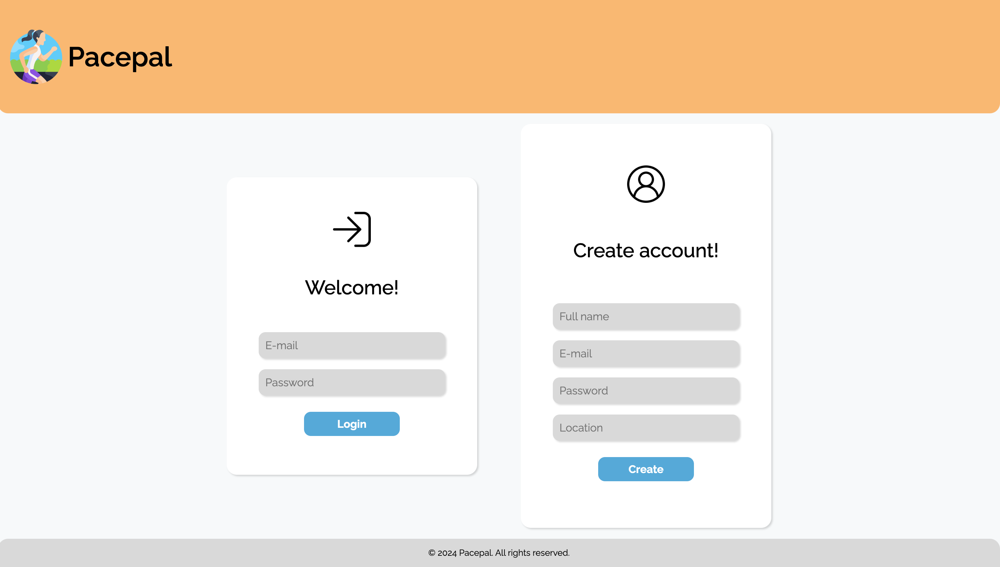 | 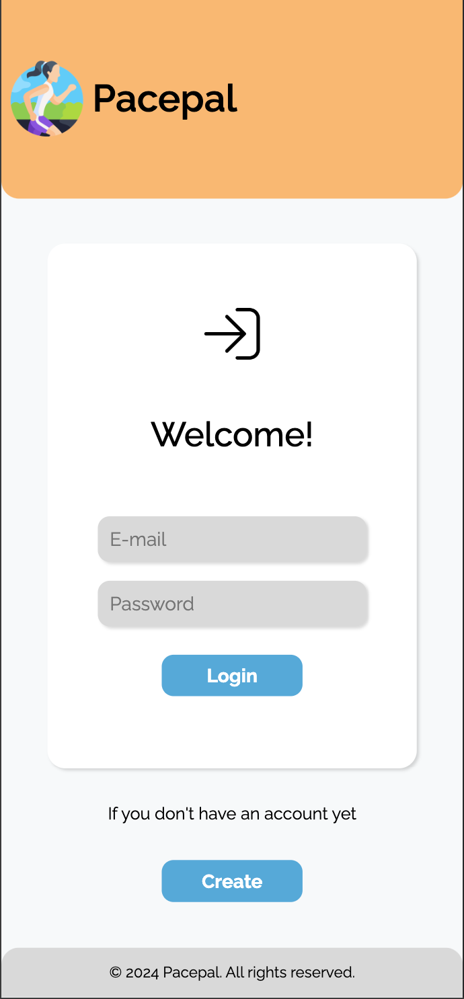 |

### ➔ Check and filter available events

On the **Races Calendar** page you can check all the available events. To narrow down your options you can:
- **search** - use search bar to filter by title or keywords in description
- **filter** - use filter by **dates**, **distance**, or **location** to narrow down results

| Desktop View                                                   | Mobile View                                         |
|----------------------------------------------------------------|-----------------------------------------------------|
| 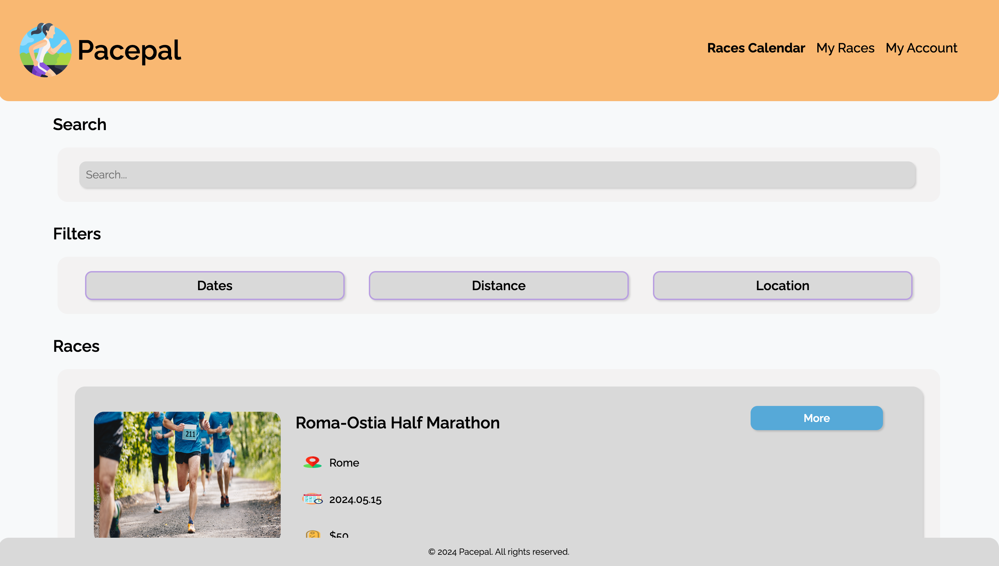          | 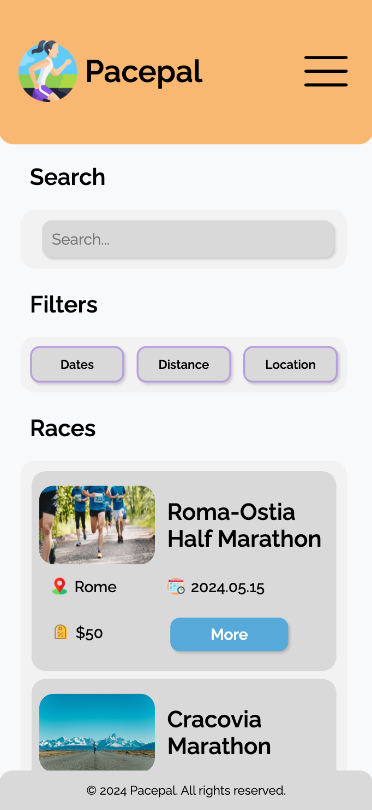 |
| 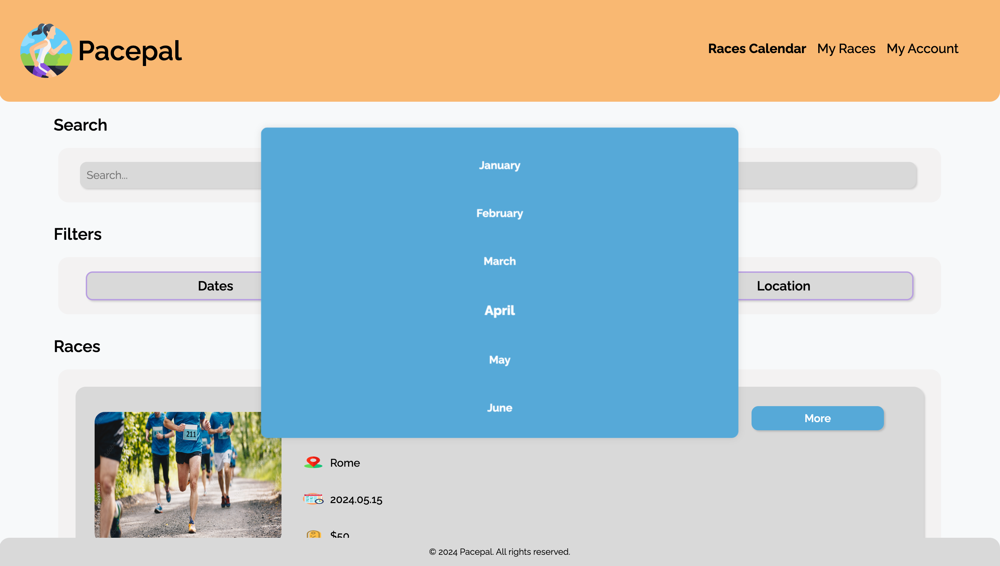 | 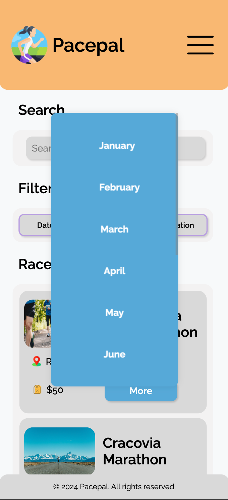

### ➔ Sign up for chosen events

On the **Race Details** page you can sign up for desired races. They will be visible under **My Races** tab upon 
successful registration.

| Desktop View                                        | Mobile View                                       |
|-----------------------------------------------------|---------------------------------------------------|
| 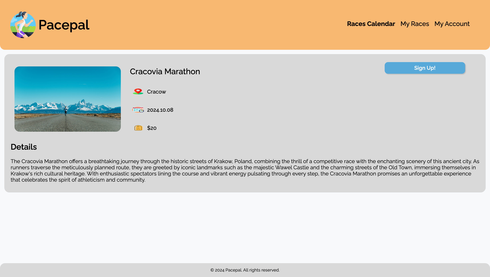 | 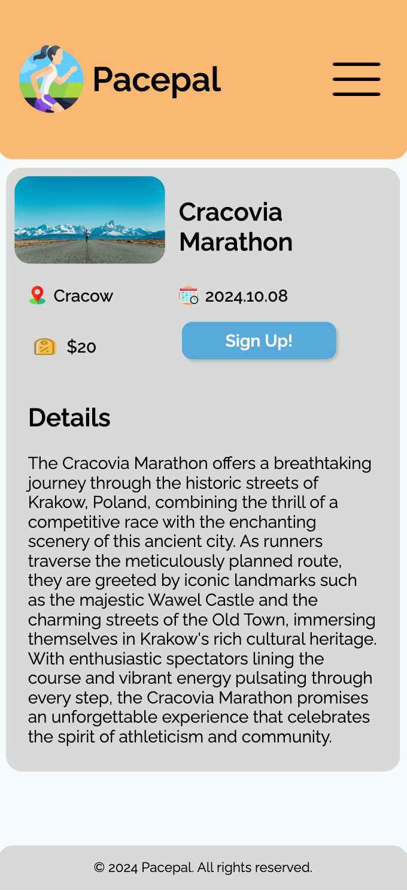 |

### ➔ See your races and view results

On **My Races** page you can view all events you are registered for, and filter them. For finished events you
can see the results.

| Desktop View                                                    | Mobile View                                                  |
|-----------------------------------------------------------------|--------------------------------------------------------------|
| 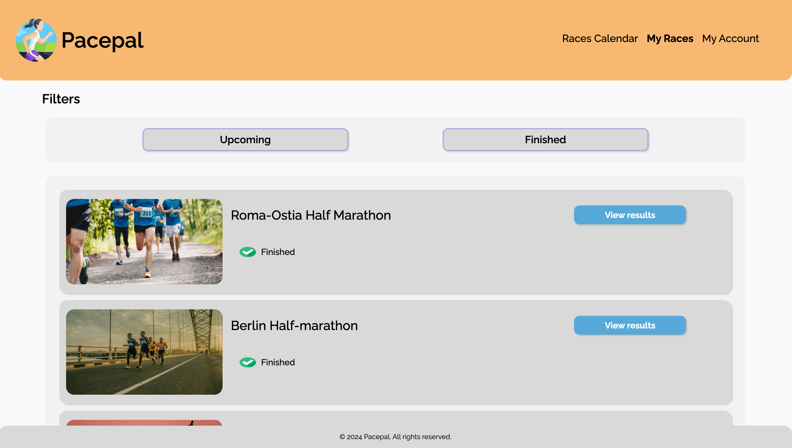     | 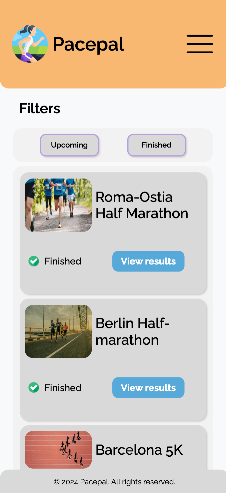    |
| 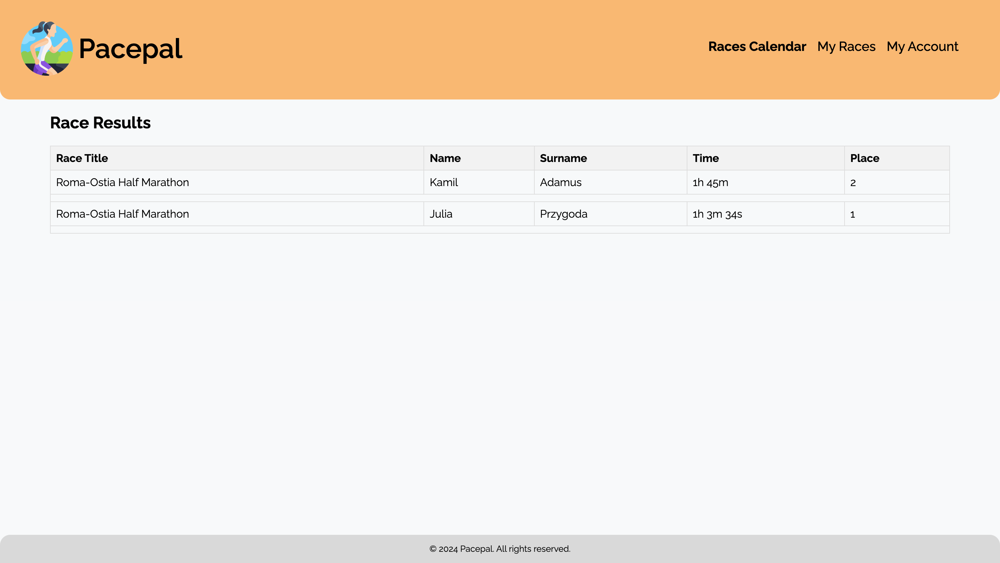 | 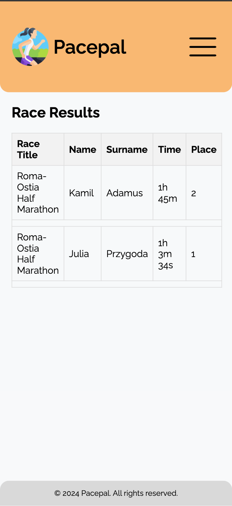 

### ➔ View your data and log out

On **My Races** page you can view your data and log out.

| Desktop View                                           | Mobile View                                          |
|--------------------------------------------------------|------------------------------------------------------|
| 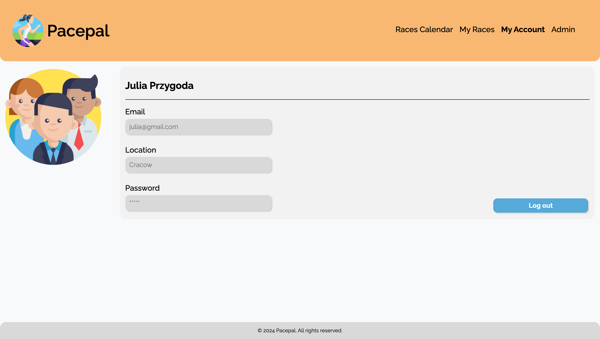 | 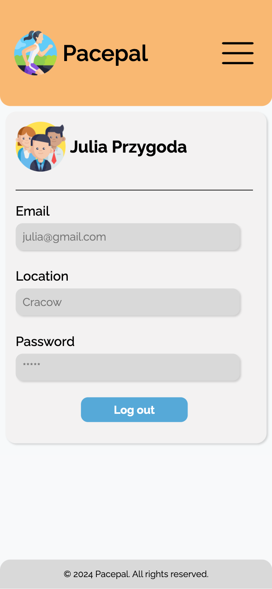 |

---
## Admin view

The **Admin View** in PacePal provides administrators with a dedicated tab to manage race results. 
Here, admins can access a list of finished races and easily upload CSV files containing the results. 

| Desktop View                                          | Mobile View                                         |
|-------------------------------------------------------|-----------------------------------------------------|
| 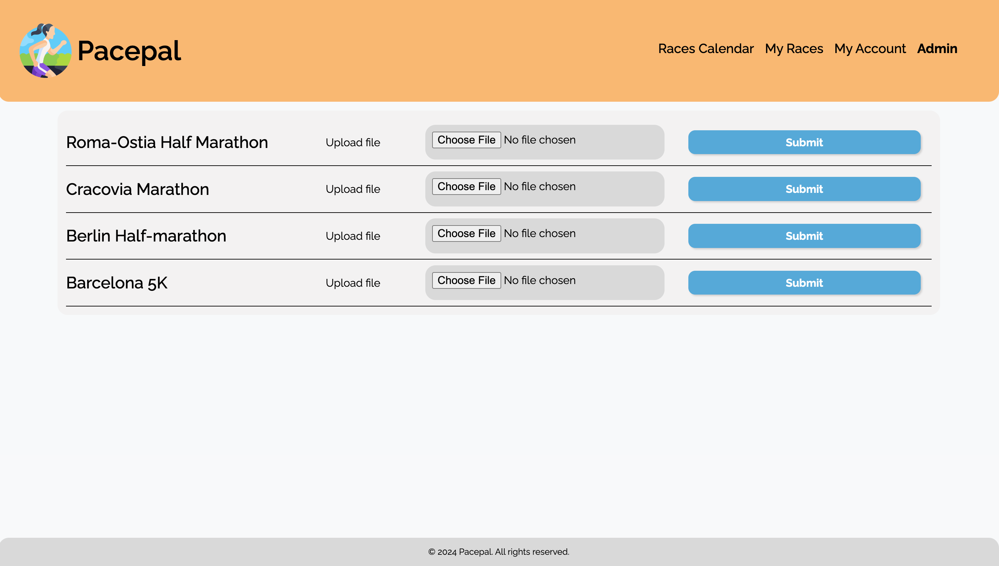 | 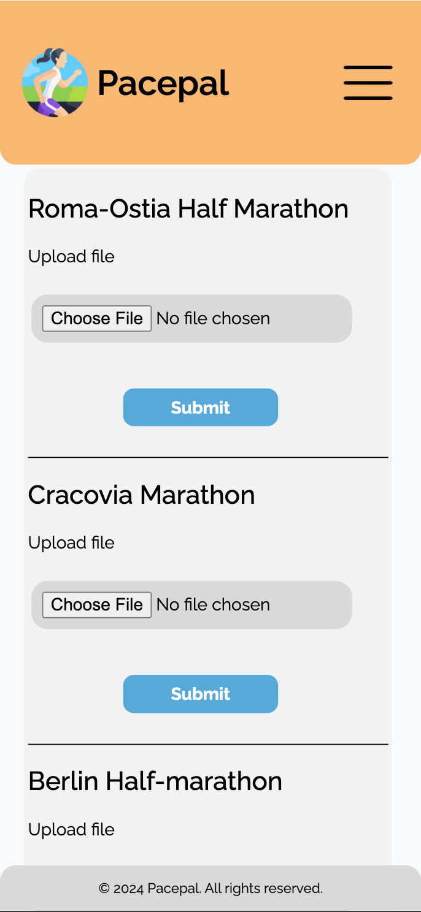 |

## Database

### Database tables on diagram
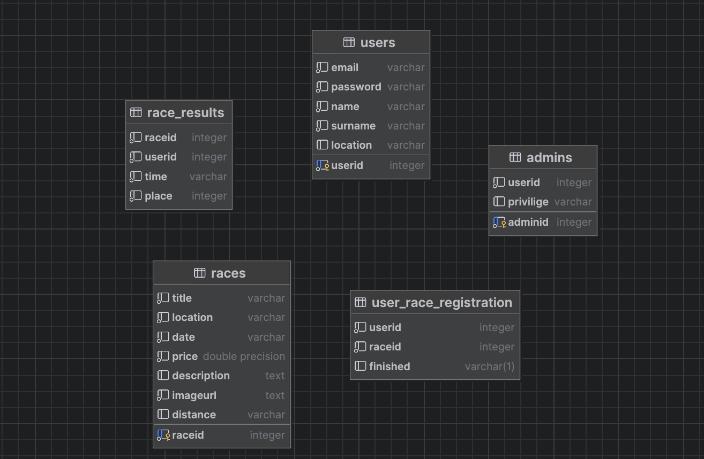

## Project structure and tech stack

### Project structure

pacepal/ \
├── Database.php \
├── Routing.php \
├── config.php \
├── docker-compose.yml \
├── index.php \
├── init.sql        # script to create and initialize database tables \
├── README.md       # documentation \
├── docker/ \
│   ├── db/ \
│   │   └── Dockerfile \
│   ├── nginx/ \
│   │   ├── Dockerfile \
│   │   └── nginx.conf \
│   └── php/ \
│       └── Dockerfile \
├── public/ \
│   ├── css/ \
│   │   └── style.css \
│   ├── img/                # Image directory \
│   ├── js/ \
│   │   ├── my_races_filters.js \
│   │   ├── races_filters.js \
│   │   ├── search.js \
│   │   ├── show_menu.js \
│   │   └── validate_fields.js \
│   ├── readme_img/         # README image directory \
│   ├── uploads/            # directory where files uploaded by administrators are stored \
│   │   └── racesresults.csv \
│   └── views/ \
│       ├── admin_view.php \
│       ├── info_message.php \
│       ├── login.php \
│       ├── my_account.php \
│       ├── my_races.php \ 
│       ├── race_details.php \
│       ├── races.php \
│       ├── register_mobile.php \
│       └── results.php \
└── src/ \ 
├── controllers/ \
│   ├── AppController.php \
│   ├── DefaultController.php \
│   ├── RacesController.php \
│   ├── SecurityController.php \
│   └── UserController.php \
├── models/ \
│   ├── DisplayedResult.php \
│   ├── Race.php \
│   ├── RaceResult.php \
│   └── User.php \
└── repository/ \
├── RacesRepository.php \
├── Repository.php \
└── UserRepository.php

### Tech stack

**Containerization**: The entire application runs on Docker, ensuring a consistent and portable environment across all 
stages of development and deployment.

**Database**: PostgreSQL was used for data management.

**Backend**: The backend is built with PHP, providing a secure and efficient server-side architecture.

**Frontend**: The user interface is created with a combination of JavaScript, CSS, and HTML, 
delivering a responsive interface.

