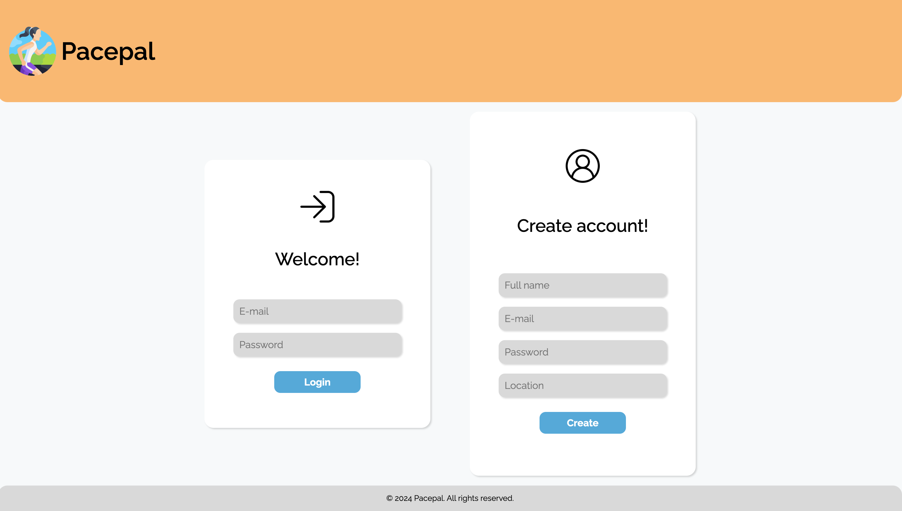
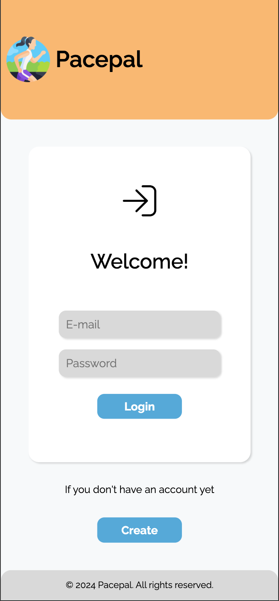

# Pacepal

Welcome to **PacePal**, your ultimate race companion! Whether you're an avid runner, a weekend warrior, or just looking 
to participate in your first race, PacePal is here to help you every step of the way.

---
## Features

- **Discover Races Worldwide:** Easily search for races of all types and distances across the globe. From marathons to 
fun runs, find events that match your interests and fitness level.
- **Effortless Sign-Up:** Register for races directly through the app with a seamless and secure sign-up process.
- **Stay Updated:** Get instant access to race details, including dates, locations, and registration deadlines.
- **View Race Results:** Check out results for past races and see how you and your friends performed. Celebrate your 
achievements and track your progress over time.

---
## About the App - Screens

Explore the various views of PacePal on both desktop and mobile devices.

### Create account and log in

On welcome page you can either create your account or log in to the existing one:

| Desktop View                                    | Mobile View                                     |
|-------------------------------------------------|-------------------------------------------------|
|  |  |

## Admin view and features

## Database diagram

## Project structure

